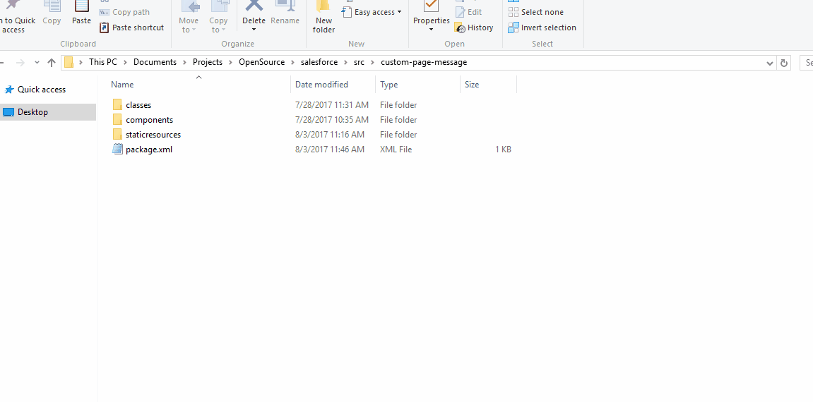

# sfdc-package-to-txt
List all types within a package.xml provided into a txt. It is a command line application.

## Usage
Just call the application without arguments having the defaults in the app.config file. You may as well pass in arguments from the command line.



### Example without argumnets

This will get the default arguments from the app.config file. In the folder "sfdc-src-project1" must exists a package.xml file, the program should generate a Components.txt.

```bash
C:\sfdc-src-project1\pacakgetotxt
```
### Example with arguments

This will get all the xml in the folder C:\sfdc-src-project1 where the name ends with "pacakge.xml" and will generate a Components.txt file for each of them in the c:\ path.
```bash
C:\pacakgetotxt --inputdir C:\sfdc-src-project1 --pattern *package.xml
```

### Table of arguments

| name              | description |
|-------------------|-------------|
| --dir        |To make easier when you want to place the output file in the same file as the source package.xml file.|
| --inputdir        |This is where the program will search into.|
| --outputdir       |This is where the program will produce the output components.txt file.|
| --outputfilename  |This is to change the output file name. By default is Components|
| --pattern         |This is to change the search pattern, by default is pacakge.xml which will search for that file, but you could use any bash(dos) pattern here, for example *.xml or *package.xml.|
| --outputextension |This is to change the output file extension, by default is .txt.|


### As Environment variable
In all my samples above, i have this little program as environment variable on Windows 10. You just have to edit the "Path" entry for the "System Variables" section, add your folder location of this program. I would recommend you to rename the program to be lowercase like i did.

# DOTNET CORE
A dotnet core version of this app has been released, you can find the src-dotnet-core folder. The bin contains the compiled version, the arguments are pretty much the same as the original .net app. I have not tried on linux yet but will try to do it soon.

## TODO 
1. Produce a cross platform version of this app.
